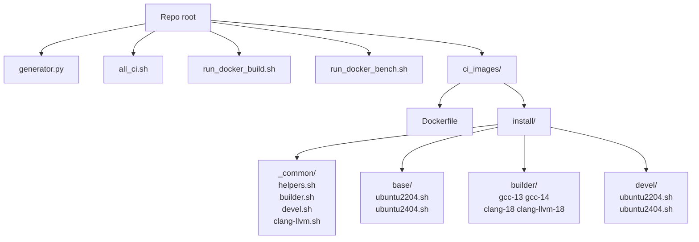
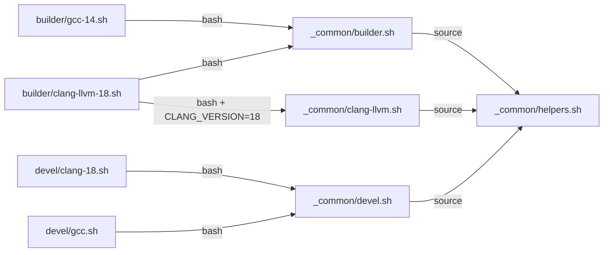
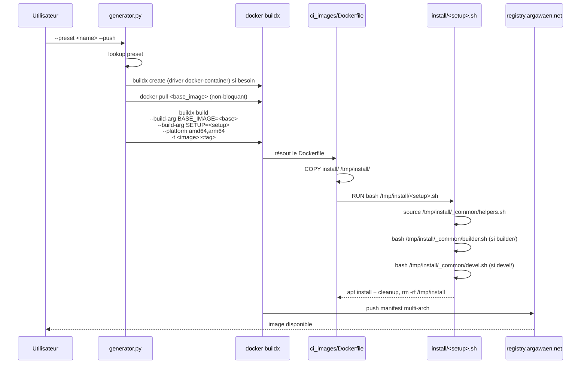
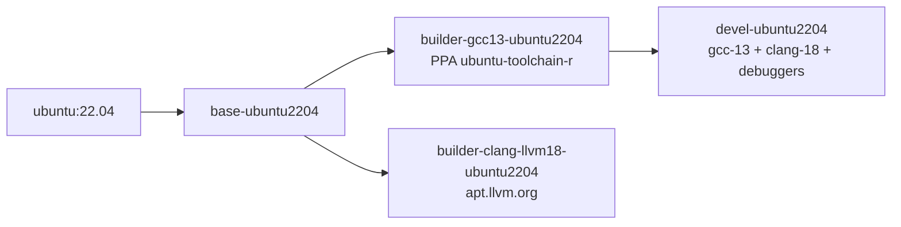
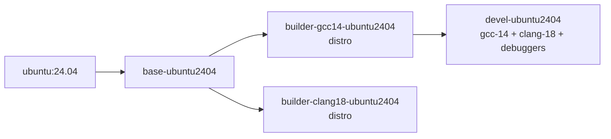
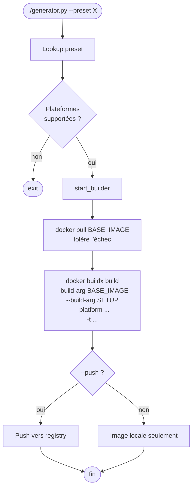
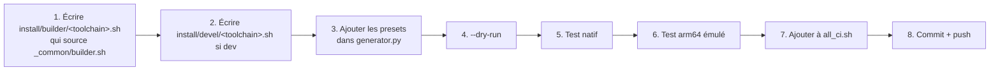
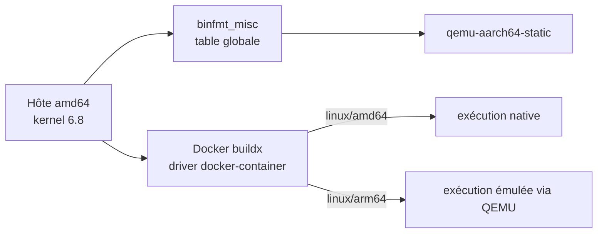

# DockerImages

Images Docker pour CI, déploiement et développement C++/Python, publiées en multi-arch
(`linux/amd64` + `linux/arm64`) sur `registry.argawaen.net/builder/`.

Chaque image est construite à partir d'**un Dockerfile unique** et d'un **script
d'installation** sélectionné par un paramètre — l'ensemble est orchestré par
`generator.py`.

---

## Table des matières

1. [Sémantique des trois couches](#1-sémantique-des-trois-couches)
2. [Démarrage rapide](#2-démarrage-rapide)
3. [Architecture](#3-architecture)
4. [Chaîne de dépendances](#4-chaîne-de-dépendances)
5. [Le `generator.py`](#5-le-generatorpy)
6. [Ajouter une nouvelle image](#6-ajouter-une-nouvelle-image)
7. [Multi-arch & QEMU](#7-multi-arch--qemu)
8. [Outils auxiliaires](#8-outils-auxiliaires)
9. [Pré-requis hôte](#9-pré-requis-hôte)
10. [Dépannage](#10-dépannage)

---

## 1. Sémantique des trois couches

| Couche    | Rôle                                                             | Contenu typique                                                                                   |
|-----------|------------------------------------------------------------------|---------------------------------------------------------------------------------------------------|
| `base`    | **Run** : exécuter l'application + ses tests                     | Python, `poetry`, libs runtime (sans `-dev`), outils d'archive, `git`, locale, utilisateur `user` |
| `builder` | **CI / build** : compiler un projet avec **un seul** toolchain   | `base` + **un** toolchain (gcc **ou** clang) + `cmake`, `ninja`, `make`, `ccache`, `mold`, libs `-dev`, `depmanager`, `gcovr` |
| `devel`   | **Poste dev** : un **seul** conteneur pour tout le workflow dev  | `builder-gcc` + **l'autre** toolchain (clang) + debuggers (`gdb`, `lldb`, `valgrind`, `strace`, `ltrace`, `lcov`, `cppcheck`, `clang-format`, `bear`, `tmux`, `less`, `vim`, `htop`, `git-lfs`) |

- `base` → `builder-gcc-*` et `builder-clang-*` (deux images CI séparées, chacune
  un seul toolchain, pour garder les images builder slim).
- `devel-<distro>` descend de `builder-gcc-*` et **ajoute clang + les debuggers** →
  un seul conteneur dev qui compile dans les deux configurations et debug tout.

---

## 2. Démarrage rapide

```bash
# Construire localement (sans push)
./generator.py --preset base-ubuntu2404

# Construire + pousser + alias :latest
./generator.py --preset builder-clang18-ubuntu2404 --push --alias-latest

# Reconstruire tout le jeu standard
./all_ci.sh

# Tourner un conteneur de build avec tmpfs + cache
./run_docker_build.sh
PLATFORM=linux/amd64 ./run_docker_build.sh
IMAGE=mon-builder:tag ./run_docker_build.sh
```

---

## 3. Architecture

### 3.1 Structure du repo



### 3.2 Partage de code via `install/_common/`

Les scripts `builder/*.sh` et `devel/*.sh` factorisent leur logique commune dans
`install/_common/`. Le `Dockerfile` copie **tout** le répertoire `install/` dans
l'image au moment du build ; chaque script final peut donc appeler son commun :



- `helpers.sh` : fonctions bash `update_package_list` / `install_package` / `clear_cache`.
- `builder.sh` : tout ce qui est commun aux images *builder* (tools, `-dev` libs, Kitware repo, depmanager).
- `devel.sh` : tout ce qui est commun aux images *devel* (debuggers, profilers, outils shell).
- `clang-llvm.sh` : template paramétrique pour toutes les variantes `apt.llvm.org`.

### 3.3 Flux de build



### 3.4 Anatomie du `Dockerfile`

```dockerfile
ARG BASE_IMAGE="ubuntu"
FROM ${BASE_IMAGE}
USER root
ARG SETUP
COPY install/ /tmp/install/
RUN bash /tmp/install/${SETUP}.sh && rm -rf /tmp/install
ENV LANG=C.UTF-8 LANGUAGE=C.UTF-8 LC_ALL=C.UTF-8
ENV PATH=/usr/poetry/venv/bin:...
USER user
```

---

## 4. Chaîne de dépendances

**Règle** : pour chaque Ubuntu on garde **deux compilateurs** — un gcc et un clang.
Le clang passe par la version LLVM apt.llvm.org si la version distro est trop
ancienne (ex: Ubuntu 22.04 → clang-llvm-18), sinon par la version distro
(Ubuntu 24.04 → clang-18).

### 4.1 Famille Ubuntu 22.04



Le `devel-ubuntu2204` descend de `builder-gcc13-ubuntu2204` (pour hériter de
cmake, ninja, libs `-dev`, etc.) et ajoute **clang-18** via apt.llvm.org + la
suite complète de debuggers / outils d'analyse.

### 4.2 Famille Ubuntu 24.04



Le `devel-ubuntu2404` descend de `builder-gcc14-ubuntu2404` et ajoute **clang-18**
depuis les paquets distro + la suite complète de debuggers.

---

## 5. Le `generator.py`

### 5.1 Presets

Chaque image est déclarée dans le dict `presets` via le helper `_preset` :

```python
"builder-clang18-ubuntu2404":
    _preset("builder-clang18-ubuntu2404", "base-ubuntu2404", "builder/clang-18"),
```

Si `base` ne contient ni `:` ni `/`, `_preset` le considère comme un nom interne et
préfixe avec `registry/namespace`. Sinon il est laissé tel quel (`ubuntu:24.04` reste
`ubuntu:24.04`).

### 5.2 Options CLI

| Flag                       | Effet                                                       |
|----------------------------|-------------------------------------------------------------|
| `--preset <nom>`           | Sélectionne un preset prédéfini                             |
| `--base-image `       | Override manuel de la base                                  |
| `--setup-file <path>`      | Override manuel du script                                   |
| `--image-name <nom>`       | Nom de l'image finale                                       |
| `--platform a,b`           | Plateformes cibles                                          |
| `--tag <tag>`              | Tag explicite (sinon `YYYYMMDD-HHMM-<gitshort>`)            |
| `--push`                   | Pousse l'image                                              |
| `--alias-latest`           | Double-tag avec `:latest`                                   |
| `--dry-run`                | Affiche les commandes sans exécuter                         |
| `--clean` / `--full-clean` | Nettoie le cache docker                                     |
| `--all-preset`             | Enchaîne tous les presets (implique `--push --alias-latest`) |

### 5.3 Cycle de vie d'un build



---

## 6. Ajouter une nouvelle image

### 6.1 Nouveau compilateur, base existante



### 6.2 Nouvelle distro

En plus des étapes ci-dessus :

1. Créer `install/base/<distro>.sh` qui **doit** :
   - créer (ou renommer) l'utilisateur `user` avec un `$HOME` valide (le Dockerfile
     termine par `USER user`) ;
   - installer Python + poetry ;
   - installer les **runtime libs** (pas les `-dev`).
2. Vérifier que `apt.llvm.org` supporte le codename pour les futurs `clang-llvm-*`.
3. Documenter l'ajout dans le README (diagramme §4) et dans `CLAUDE.md`.

### 6.3 Template minimal

**Builder** :

```bash
#!/usr/bin/env bash
set -e
bash /tmp/install/_common/builder.sh
. /tmp/install/_common/helpers.sh

update_package_list
install_package g++-NN
update-alternatives --install /usr/bin/gcc gcc /usr/bin/gcc-NN NN
clear_cache
```

**Devel** (pour un builder gcc — tout est déjà dans le commun) :

```bash
#!/usr/bin/env bash
set -e
bash /tmp/install/_common/devel.sh
```

---

## 7. Multi-arch & QEMU



Pièges connus :

| Symptôme                                         | Cause                                     | Résolution                                                  |
|--------------------------------------------------|-------------------------------------------|-------------------------------------------------------------|
| `exec format error` arm64                        | `binfmt_misc` pas installé sur l'hôte     | `apt install qemu-user-static binfmt-support`               |
| `qemu: uncaught target signal 11` en 22.04 arm64 | glibc 2.35 + MTE mal émulé                | Ne pas utiliser 22.04 arm64 ; privilégier bookworm / 24.04  |
| Builds 3× plus lents en 24.04 arm64              | PAC/BTI et glibc 2.39 durcie              | Cf `TODO_docker_images_optimization.md` (roadmap Debian)    |

---

## 8. Outils auxiliaires

### `run_docker_build.sh`

Wrapper `docker run` optimisé (tmpfs, cache depmanager persistant, seccomp relâché,
tunables glibc). Variables d'env : `PLATFORM`, `IMAGE`, `CMD`, `DM_CACHE`, `TMPFS_SIZE`.

### `run_docker_bench.sh`

Microbench qui compare l'overhead d'émulation QEMU pour une liste d'images (bash loop,
startup shell, startup Python, compile C simple).

```bash
./run_docker_bench.sh                                     # images par défaut
./run_docker_bench.sh ubuntu:24.04 debian:bookworm-slim   # images custom
```

---

## 9. Pré-requis hôte

Pour builder multi-arch sur une machine amd64 :

```bash
sudo apt install -y qemu-user-static binfmt-support
sudo systemctl enable --now binfmt-support

echo 'kernel.apparmor_restrict_unprivileged_userns=0' \
  | sudo tee /etc/sysctl.d/60-apparmor-userns.conf
sudo sysctl --system

docker buildx create --use --driver docker-container
```

Sur l'hôte CI TeamCity (DinD), les réglages kernel doivent être faits sur la VM
**hôte**, pas dans le conteneur TeamCity ni dans son DinD interne.

---

## 10. Dépannage

| Problème                                                | Piste                                                          |
|---------------------------------------------------------|----------------------------------------------------------------|
| `Unsupported platform linux/arm64`                      | `docker buildx create --use --driver docker-container`         |
| `docker pull ... denied` sur image interne              | `docker login registry.argawaen.net`                           |
| `exec format error` au `RUN bash /tmp/install/...`      | `binfmt_misc` pas activé côté hôte (cf §9)                     |
| Un `-dev` manque au build                               | Le builder parent l'installe-t-il ? (cf `_common/builder.sh`)  |
| Une devel plante car le parent builder n'existe pas     | Ordre dans `all_ci.sh` : base → builder → devel                |
| Un `.sh` ne trouve pas `/tmp/install/_common/...`       | Le `Dockerfile` doit copier `install/` entier (pas juste un script) |

Pour tout autre problème, consulter `BUGS.md` (audit statique) et
`TODO_docker_images_optimization.md` (roadmap perf).
