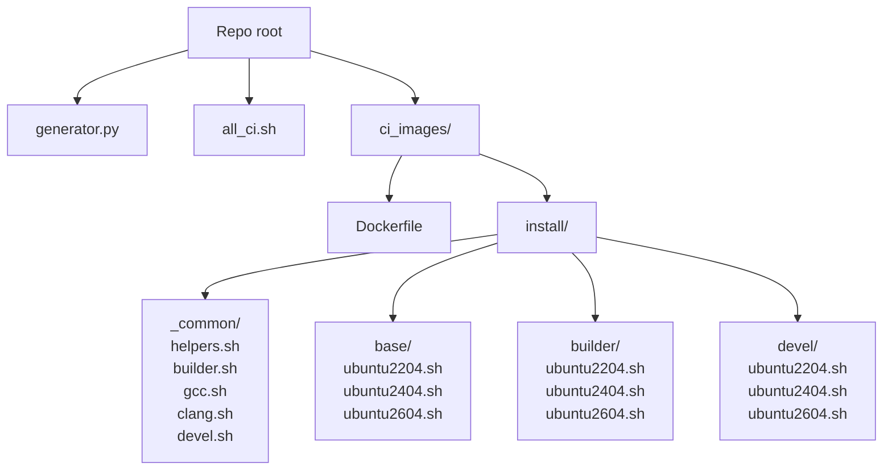
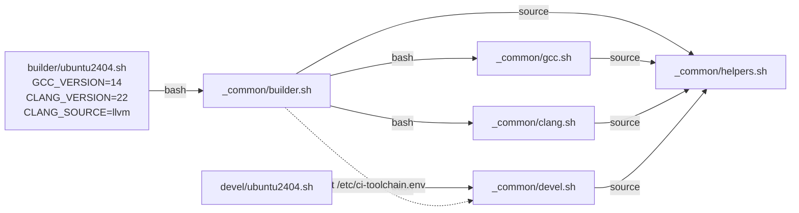
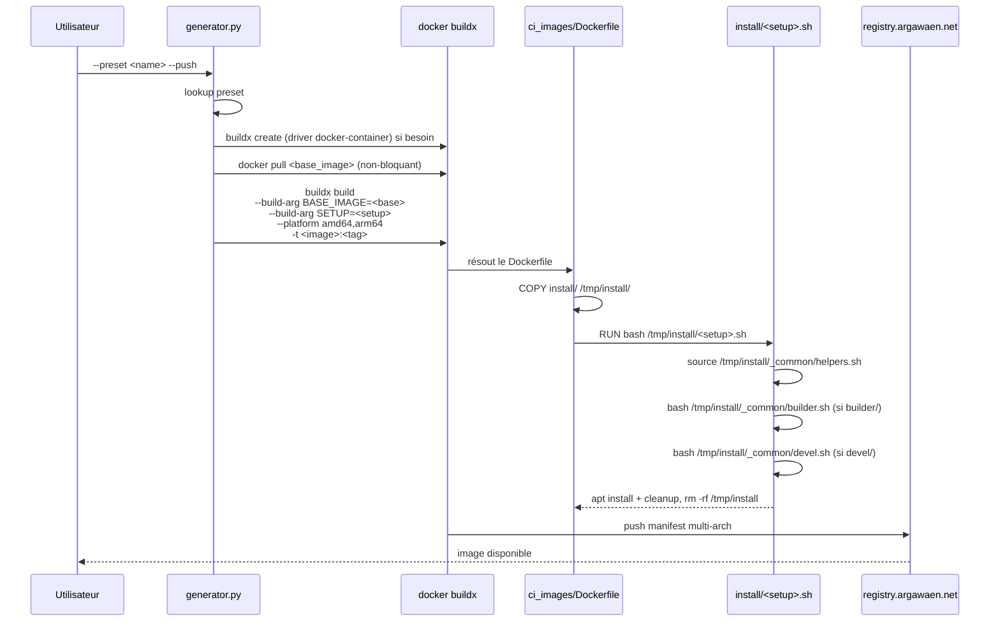
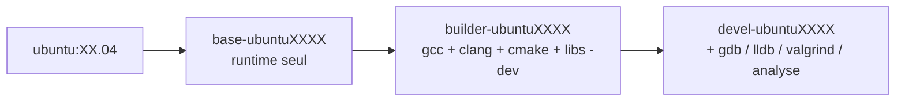
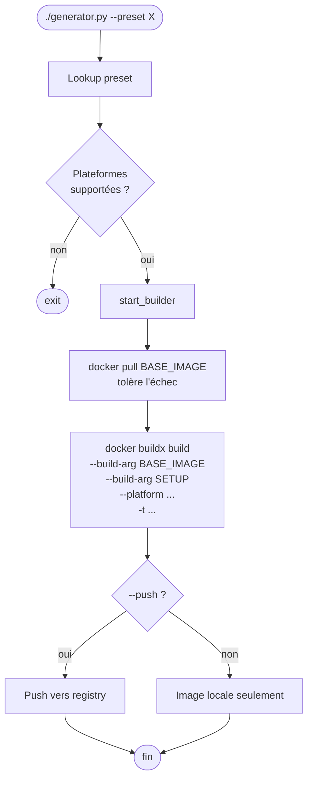
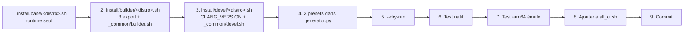
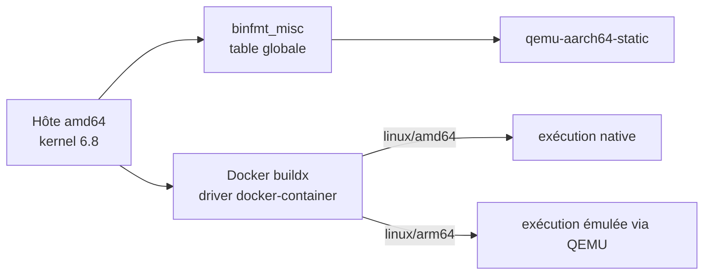

# DockerImages

Images Docker pour CI, déploiement et développement C++/Python, publiées en multi-arch
(`linux/amd64` + `linux/arm64`) sur `registry.argawaen.net/builder/`.

Chaque image est construite à partir d'**un Dockerfile unique** et d'un **script
d'installation** sélectionné par un paramètre — l'ensemble est orchestré par
`generator.py`.

---

## Table des matières

1. [Sémantique des trois couches](#1-sémantique-des-trois-couches)
2. [Démarrage rapide](#2-démarrage-rapide)
3. [Architecture](#3-architecture)
4. [Chaîne de dépendances](#4-chaîne-de-dépendances)
5. [Le `generator.py`](#5-le-generatorpy)
6. [Ajouter une nouvelle image](#6-ajouter-une-nouvelle-image)
7. [Multi-arch & QEMU](#7-multi-arch--qemu)
8. [Pré-requis hôte](#8-pré-requis-hôte)
9. [Dépannage](#9-dépannage)

---

## 1. Sémantique des trois couches

| Couche    | Rôle                                                   | Contenu typique                                                                                   |
|-----------|--------------------------------------------------------|---------------------------------------------------------------------------------------------------|
| `base`    | **Run** : exécuter l'application + ses tests           | Python, `poetry`, **toute la suite runtime X11/XCB + Wayland** (`xkb-data`, `libdecor-0-0`), GTK/TLS/son/Vulkan — **aucun `-dev`**, aucun compilateur — outils d'archive, `git`, locale, utilisateur `user` |
| `builder` | **CI / build** : *l'*environnement de compilation      | `base` + **les deux** toolchains (gcc stock **et** clang-22) + `cmake`, `ninja`, `make`, `ccache`, `mold`, `patchelf`, `doxygen`, `pkg-config` + **toutes** les libs `-dev` (X11/XCB complet, `libwayland-dev`, `libdecor-0-dev`, son, Vulkan) |
| `devel`   | **Poste dev** : builder + outillage de debug / analyse | `builder` + `gdb`, `lldb-22`, `valgrind`, `strace`, `ltrace`, `gperf`, `lcov`, `cppcheck`, `bear`, `perf`, `tmux`, `less`, `vim`, `htop`, `git-lfs` |

Une **seule** image par couche et par distro : `base-<distro>` → `builder-<distro>`
→ `devel-<distro>`. Le builder embarque gcc **et** clang, un job CI choisit son
compilateur via `CC`/`CXX` sans changer d'image.

Distributions publiées :

| Distro       | glibc | gcc (stock) | clang            | arm64 émulé QEMU                                                 |
|--------------|-------|-------------|------------------|-------------------------------------------------------------------|
| Ubuntu 22.04 | 2.35  | 12.3.0      | 22 (apt.llvm.org)| ✓ sur hôte 26.04 LTS ; ❌ bash SIGSEGV sur 24.04 host (QEMU 8.2)  |
| Ubuntu 24.04 | 2.39  | 14.2.0      | 22 (apt.llvm.org)| ✓ sur toute version QEMU                                          |
| Ubuntu 26.04 | 2.43  | 15.2.0      | 22 (universe)    | ✓ sur toute version QEMU                                          |

---

## 2. Démarrage rapide

```bash
# Construire localement (sans push)
./generator.py --preset base-ubuntu2404

# Construire + pousser + alias :latest
./generator.py --preset builder-ubuntu2404 --push --alias-latest

# Reconstruire tout le jeu standard
./all_ci.sh

# Lister les presets disponibles
./generator.py --preset inexistant
```

---

## 3. Architecture

### 3.1 Structure du repo


```mermaid
graph TD
    R[Repo root] --> G[generator.py]
    R --> A[all_ci.sh]
    R --> C[ci_images/]
    C --> D[Dockerfile]
    C --> I[install/]
    I --> CO[_common/<br/>helpers.sh<br/>builder.sh<br/>gcc.sh<br/>clang.sh<br/>devel.sh]
    I --> IB[base/<br/>ubuntu2204.sh<br/>ubuntu2404.sh<br/>ubuntu2604.sh]
    I --> IR[builder/<br/>ubuntu2204.sh<br/>ubuntu2404.sh<br/>ubuntu2604.sh]
    I --> IV[devel/<br/>ubuntu2204.sh<br/>ubuntu2404.sh<br/>ubuntu2604.sh]
```

### 3.2 Partage de code via `install/_common/`

Les scripts `builder/*.sh` et `devel/*.sh` factorisent leur logique commune dans
`install/_common/`. Le `Dockerfile` copie **tout** le répertoire `install/` dans
l'image au moment du build ; chaque script final peut donc appeler son commun :


```mermaid
graph LR
    S1["builder/ubuntu2404.sh<br/>GCC_VERSION=14<br/>CLANG_VERSION=22<br/>CLANG_SOURCE=llvm"] -->|bash| CB[_common/builder.sh]
    CB -->|bash| CG[_common/gcc.sh]
    CB -->|bash| CC[_common/clang.sh]
    S2["devel/ubuntu2404.sh"] -->|bash| CD[_common/devel.sh]
    CB -.->|"écrit /etc/ci-toolchain.env"| CD
    CB -->|source| CH[_common/helpers.sh]
    CG -->|source| CH
    CC -->|source| CH
    CD -->|source| CH
```

- `helpers.sh` : fonctions bash `update_package_list` / `install_package` /
  `clear_cache` / `distro_codename` / `setup_default_user`.
- `builder.sh` : tout le commun *builder* (tools, `-dev` libs, repo Kitware) puis
  appelle `gcc.sh` **et** `clang.sh` — c'est lui qui fait qu'un builder embarque
  les deux toolchains.
- `gcc.sh` : installeur gcc paramétrique (`GCC_VERSION`) + `update-alternatives`.
- `clang.sh` : installeur clang paramétrique (`CLANG_VERSION`,
  `CLANG_SOURCE=distro|llvm`), lie clang à `libstdc++-${STDCPP_VER}` (par défaut
  `GCC_VERSION`).
- `devel.sh` : outillage de debug / analyse commun aux images *devel*, dont
  `lldb-${CLANG_VERSION}`. Il lit les versions dans `/etc/ci-toolchain.env`,
  écrit par `builder.sh` dans l'image parente — un script `devel/*.sh` n'a donc
  aucune version à répéter.

Les scripts de chaque couche ne contiennent donc plus que la déclaration des
versions :

```bash
# builder/ubuntu2604.sh
export GCC_VERSION=15
export CLANG_VERSION=22
export CLANG_SOURCE=distro
bash /tmp/install/_common/builder.sh
```

### 3.3 Flux de build


```mermaid
sequenceDiagram
    participant U as Utilisateur
    participant G as generator.py
    participant BX as docker buildx
    participant DF as ci_images/Dockerfile
    participant S as install/<setup>.sh
    participant R as registry.argawaen.net

    U->>G: --preset <name> --push
    G->>G: lookup preset
    G->>BX: buildx create (driver docker-container) si besoin
    G->>BX: docker pull <base_image> (non-bloquant)
    G->>BX: buildx build<br/>--build-arg BASE_IMAGE=<base><br/>--build-arg SETUP=<setup><br/>--platform amd64,arm64<br/>-t <image>:<tag>
    BX->>DF: résout le Dockerfile
    DF->>DF: COPY install/ /tmp/install/
    DF->>S: RUN bash /tmp/install/<setup>.sh
    S->>S: source /tmp/install/_common/helpers.sh
    S->>S: bash /tmp/install/_common/builder.sh (si builder/)
    S->>S: bash /tmp/install/_common/devel.sh (si devel/)
    S-->>DF: apt install + cleanup, rm -rf /tmp/install
    BX->>R: push manifest multi-arch
    R-->>U: image disponible
```

### 3.4 Anatomie du `Dockerfile`

```dockerfile
ARG BASE_IMAGE="ubuntu"
FROM ${BASE_IMAGE}
USER root
ARG SETUP
COPY install/ /tmp/install/
RUN bash /tmp/install/${SETUP}.sh && rm -rf /tmp/install
ENV LANG=C.UTF-8 LANGUAGE=C.UTF-8 LC_ALL=C.UTF-8
ENV PATH=/usr/poetry/venv/bin:...
USER user
```

---

## 4. Chaîne de dépendances

**Règle** : chaîne linéaire d'une seule image par couche.


```mermaid
graph LR
    U[ubuntu:XX.04] --> B["base-ubuntuXXXX<br/>runtime seul"]
    B --> R["builder-ubuntuXXXX<br/>gcc + clang + cmake + libs -dev"]
    R --> D["devel-ubuntuXXXX<br/>+ gdb / lldb / valgrind / analyse"]
```

Règle dure : les binaires produits doivent s'exécuter sur un Ubuntu **stock
Canonical (main + universe)** de la même révision — pas de PPA exigé côté
utilisateur final. Cela impose `gcc` natif stock et clang lié à la
libstdc++ stock.

### 4.1 Toolchains par famille

| Famille      | base           | gcc                      | clang                                  | devel            |
|--------------|----------------|--------------------------|----------------------------------------|------------------|
| Ubuntu 22.04 | `ubuntu:22.04` | `gcc-12` (main, stock)   | `clang-22` — apt.llvm.org (distro ≤ 15)| `devel-ubuntu2204` |
| Ubuntu 24.04 | `ubuntu:24.04` | `gcc-14` (stock)         | `clang-22` — apt.llvm.org (distro ≤ 18)| `devel-ubuntu2404` |
| Ubuntu 26.04 | `ubuntu:26.04` | `gcc-15` (main, stock)   | `clang-22` — **universe**, pas de repo tiers | `devel-ubuntu2604` |

Le choix se fait dans `install/builder/<distro>.sh` via trois variables
(`GCC_VERSION`, `CLANG_VERSION`, `CLANG_SOURCE`) — aucun autre endroit à
toucher.

### 4.2 Portabilité runtime — garantie

| Distro builder | libstdc++ linkée à la compilation | libstdc++6 stock du runtime | Compat |
|----------------|-----------------------------------|-----------------------------|--------|
| Ubuntu 22.04   | `libstdc++-12-dev` (12.3.0)       | 12.3.0                      | ✓      |
| Ubuntu 24.04   | `libstdc++-14-dev` (14.2.0)       | 14.2.0                      | ✓      |
| Ubuntu 26.04   | `libstdc++-15-dev` (15.2.0)       | snapshot gcc-16 (sur-ensemble ABI) | ✓ |

`_common/clang.sh` lie clang à `libstdc++-${STDCPP_VER}-dev` où `STDCPP_VER`
vaut par défaut `GCC_VERSION` — donc exactement la libstdc++ du gcc stock
choisi, jamais une plus récente. (26.04 ship un `libstdc++6` construit depuis
un snapshot gcc-16 : s'aligner sur `GCC_VERSION` évite d'aller chercher les
en-têtes d'un gcc non-stock.)

---

## 5. Le `generator.py`

### 5.1 Presets

Chaque image est déclarée dans le dict `presets` via le helper `_preset` :

```python
"builder-ubuntu2404":
    _preset("builder-ubuntu2404", "base-ubuntu2404", "builder/ubuntu2404"),
```

Si `base` ne contient ni `:` ni `/`, `_preset` le considère comme un nom interne et
préfixe avec `registry/namespace`. Sinon il est laissé tel quel (`ubuntu:24.04` reste
`ubuntu:24.04`).

### 5.2 Options CLI

| Flag                       | Effet                                                       |
|----------------------------|-------------------------------------------------------------|
| `--preset <nom>`           | Sélectionne un preset prédéfini                             |
| `--base-image `       | Override manuel de la base                                  |
| `--setup-file <path>`      | Override manuel du script                                   |
| `--image-name <nom>`       | Nom de l'image finale                                       |
| `--platform a,b`           | Plateformes cibles                                          |
| `--tag <tag>`              | Tag explicite (sinon `YYYYMMDD-HHMM-<gitshort>`)            |
| `--push`                   | Pousse l'image                                              |
| `--alias-latest`           | Double-tag avec `:latest`                                   |
| `--dry-run`                | Affiche les commandes sans exécuter                         |
| `--clean` / `--full-clean` | Nettoie le cache docker                                     |
| `--all-preset`             | Enchaîne tous les presets (implique `--push --alias-latest`) |

### 5.3 Cycle de vie d'un build


```mermaid
flowchart TD
    S([./generator.py --preset X]) --> L[Lookup preset]
    L --> V{Plateformes<br/>supportées ?}
    V -- non --> E([exit])
    V -- oui --> B[start_builder]
    B --> P[docker pull BASE_IMAGE<br/>tolère l'échec]
    P --> D[docker buildx build<br/>--build-arg BASE_IMAGE<br/>--build-arg SETUP<br/>--platform ...<br/>-t ...]
    D --> F{--push ?}
    F -- oui --> PU[Push vers registry]
    F -- non --> LOC[Image locale seulement]
    PU --> END([fin])
    LOC --> END
```

---

## 6. Ajouter une nouvelle image

### 6.1 Changer de version de toolchain sur une distro existante

Éditer les trois `export` de `install/builder/<distro>.sh`, puis
`install/devel/<distro>.sh` si `CLANG_VERSION` change (il pilote `lldb-N`).
Rien d'autre.

### 6.2 Nouvelle distro


```mermaid
flowchart LR
    A[1. install/base/&lt;distro&gt;.sh<br/>runtime seul] --> B[2. install/builder/&lt;distro&gt;.sh<br/>3 export + _common/builder.sh]
    B --> C[3. install/devel/&lt;distro&gt;.sh<br/>CLANG_VERSION + _common/devel.sh]
    C --> D[4. 3 presets dans generator.py]
    D --> E[5. --dry-run]
    E --> F[6. Test natif]
    F --> G[7. Test arm64 émulé]
    G --> H[8. Ajouter à all_ci.sh]
    H --> I[9. Commit]
```

Le script `install/base/<distro>.sh` **doit** :

- appeler `setup_default_user` (le Dockerfile termine par `USER user`) ;
- installer Python + poetry ;
- installer les **runtime libs** (pas les `-dev`) — attention aux renommages
  (`t64`, `p7zip` → `7zip`, paquets retirés de l'archive).

À vérifier avant : Kitware et (si `CLANG_SOURCE=llvm`) `apt.llvm.org` publient
bien le codename de la distro.

### 6.3 Template minimal

**Builder** :

```bash
#!/usr/bin/env bash
set -e
export GCC_VERSION=NN
export CLANG_VERSION=NN
export CLANG_SOURCE=llvm     # ou 'distro' si la distro ship la bonne version
bash /tmp/install/_common/builder.sh
```

**Devel** :

```bash
#!/usr/bin/env bash
set -e
bash /tmp/install/_common/devel.sh
```

---

## 7. Multi-arch & QEMU


```mermaid
graph LR
    HOST[Hôte amd64<br/>kernel 6.8] --> BINFMT[binfmt_misc<br/>table globale]
    BINFMT --> QEMU[qemu-aarch64-static]
    HOST --> DOCKER[Docker buildx<br/>driver docker-container]
    DOCKER -- linux/amd64 --> NATIF[exécution native]
    DOCKER -- linux/arm64 --> EMUL[exécution émulée via QEMU]
```

Pièges connus :

| Symptôme                                         | Cause                                     | Résolution                                                  |
|--------------------------------------------------|-------------------------------------------|-------------------------------------------------------------|
| `exec format error` arm64                        | `binfmt_misc` pas installé sur l'hôte     | `apt install qemu-user-static binfmt-support`               |
| `qemu: uncaught target signal 11` en 22.04 arm64 | glibc 2.35 + MTE mal émulé                | Ne pas utiliser 22.04 arm64 ; privilégier bookworm / 24.04  |
| Builds 3× plus lents en 24.04 arm64              | PAC/BTI et glibc 2.39 durcie              | Cf `BENCHMARK_arm64_emulation.md` (roadmap Debian)    |

---

## 8. Pré-requis hôte

Pour builder multi-arch sur une machine amd64 :

```bash
sudo apt install -y qemu-user-static binfmt-support
sudo systemctl enable --now binfmt-support

echo 'kernel.apparmor_restrict_unprivileged_userns=0' \
  | sudo tee /etc/sysctl.d/60-apparmor-userns.conf
sudo sysctl --system

docker buildx create --use --driver docker-container
```

Sur l'hôte CI TeamCity (DinD), les réglages kernel doivent être faits sur la VM
**hôte**, pas dans le conteneur TeamCity ni dans son DinD interne.

---

## 9. Dépannage

| Problème                                                | Piste                                                          |
|---------------------------------------------------------|----------------------------------------------------------------|
| `Unsupported platform linux/arm64`                      | `docker buildx create --use --driver docker-container`         |
| `docker pull ... denied` sur image interne              | `docker login registry.argawaen.net`                           |
| `exec format error` au `RUN bash /tmp/install/...`      | `binfmt_misc` pas activé côté hôte (cf §8)                     |
| Un `-dev` manque au build                               | Le builder parent l'installe-t-il ? (cf `_common/builder.sh`)  |
| Un `.so` manque à l'exécution mais le build passait     | Le `-dev` est dans `builder.sh` sans son runtime dans `base/*.sh` — les deux listes X11/XCB doivent rester alignées |
| Une devel plante car le parent builder n'existe pas     | Ordre dans `all_ci.sh` : base → builder → devel                |
| Un `.sh` ne trouve pas `/tmp/install/_common/...`       | Le `Dockerfile` doit copier `install/` entier (pas juste un script) |
| `GCC_VERSION must be set by the caller`                 | `_common/builder.sh` appelé sans les `export` du script de couche |
| `GCC_VERSION not set and /etc/ci-toolchain.env unusable` | Un `devel/*` construit sur autre chose qu'un `builder-*`         |
| `gcc --version` ≠ `g++ --version` dans une image        | Un paquet a tiré le méta `gcc` : rappeler `register_gcc_alternatives` en fin de script |
| `lookup ... i/o timeout` pendant un buildx build        | Le conteneur `buildx_buildkit_*` a figé le `/etc/resolv.conf` de l'hôte au moment de sa création : si les resolvers ont changé depuis (VPN, changement de réseau), il pointe dans le vide. `docker restart buildx_buildkit_<builder>0` régénère le resolv.conf **et préserve le cache** ; recréer le builder n'est pas nécessaire. |

Pour tout autre problème, consulter `BUGS.md` (audit statique) et
`BENCHMARK_arm64_emulation.md` (roadmap perf).
